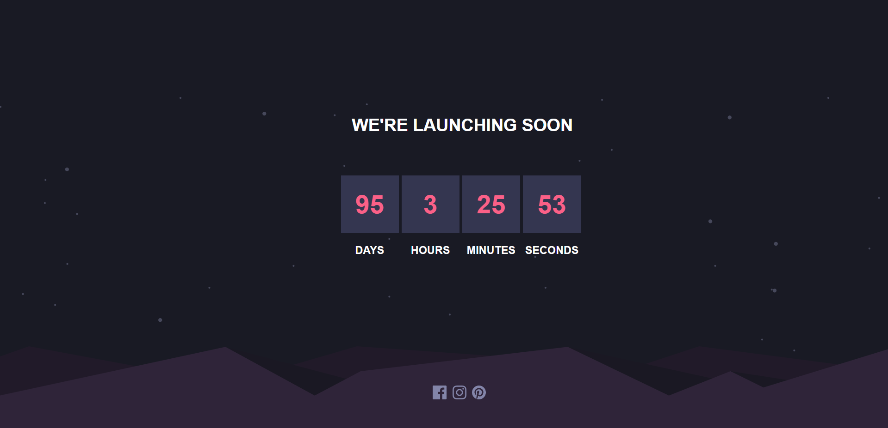

# Frontend Mentor - Launch countdown timer solution

This is a solution to the [Launch countdown timer challenge on Frontend Mentor](https://www.frontendmentor.io/challenges/launch-countdown-timer-N0XkGfyz-). Frontend Mentor challenges help you improve your coding skills by building realistic projects. 

## Table of contents

- [Overview](#overview)
  - [The challenge](#the-challenge)
  - [Screenshot](#screenshot)
  - [Links](#links)
- [My process](#my-process)
  - [Built with](#built-with)
  - [What I learned](#what-i-learned)
  - [Continued development](#continued-development)
  - [Useful resources](#useful-resources)
- [Author](#author)
- [Acknowledgments](#acknowledgments)

## Overview

### The challenge

Users should be able to:

- See hover states for all interactive elements on the page
- See a live countdown timer that ticks down every second (start the count at 14 days)
- **Bonus**: When a number changes, make the card flip from the middle

### Screenshot

### Links

- Solution URL: [Add solution URL here](https://www.frontendmentor.io/solutions/create-timer-by-react-O4G4ukGnoq)
- Live Site URL: [Add live site URL here](https://creative-tapioca-e701db.netlify.app/)

## My process

1. import all the element(e.g.: star, hill, time...) at the begining.
2. I need to calculate how many time left depend on deadline, I create CalcTime() to count the time and return the value to `useState()`
3. revise layout (e.g.: `position`)
4. design the website for mobile by using `@media` in CSS. 

### Built with

- Semantic HTML5 markup
- CSS custom properties
- CSS Grid
- [React](https://reactjs.org/) - JS library
- [Next.js](https://nextjs.org/) - React framework

### What I learned

1. While need to change color while color, add `:hover` to control the change.
2. Some svg may be too large, you can use `position` to control page
3. use `useState` and `useEffect` to track a life circle element.

### Continued development

### Useful resources

- [SVG hover](https://codesandbox.io/s/t2l3b?file=%2Fsrc%2Fstyles.css%3A202-277&fbclid=IwAR3fn6jCKSXWYp0C7BCwY41Q0kgL1H_iiMZUZJ8XFrVsRBFphRBdec67tI4) - This helped me for import svg file in React and design `hover` effect

## Author

- Website - [Chious](https://github.com/Chious)
- Frontend Mentor - [@Chious](https://www.frontendmentor.io/profile/Chious)
- Twitter - [@Chious](https://twitter.com/ChiouJiaSheng)

## Acknowledgments

Nope
